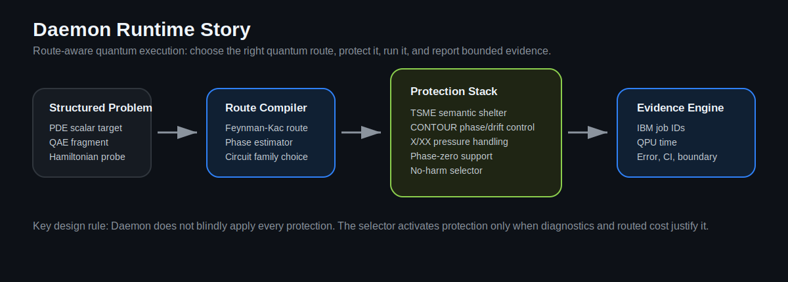
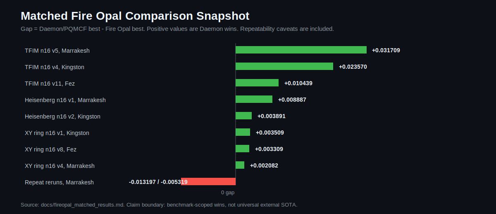
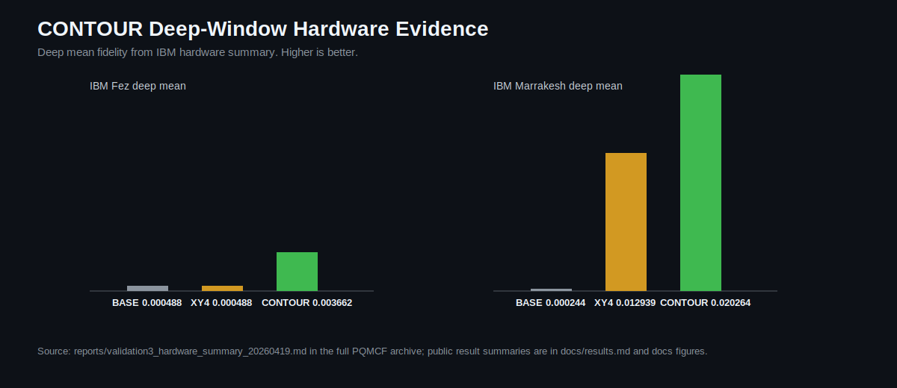
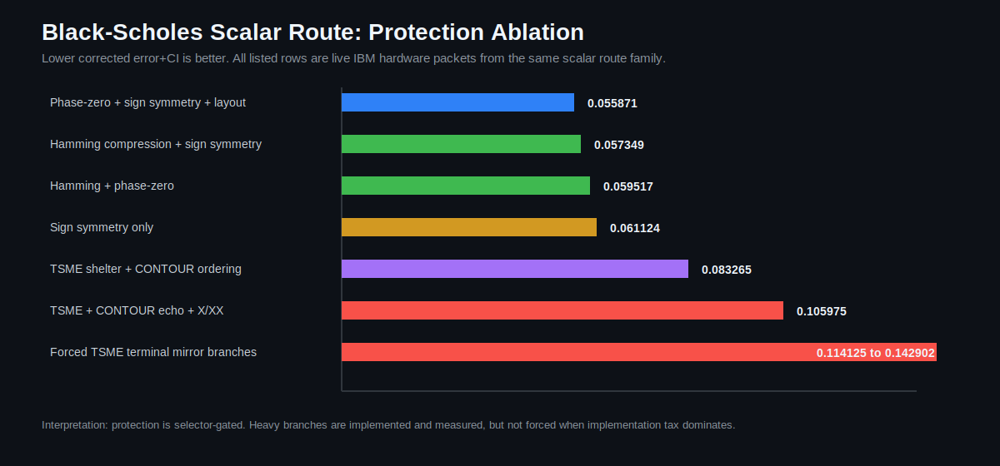

# Daemon Results Story

Updated 2026-05-29.

This report gives the public technical narrative for Daemon without exposing proprietary compiler internals, calibration logic, scheduling policy, or proof-level method details.

The short version:

```text
Daemon is a protected quantum runtime stack.
It has live IBM evidence across deep-time protection, matched Fire Opal comparisons,
and a newer Black-Scholes/Feynman-Kac scalar application route.
```

## 1. System View

Daemon is designed as a stack, not a single mitigation pass.



The important separation is:

| Layer | What is public here | What is withheld |
| --- | --- | --- |
| Problem route | Workload class, target, backend, result, report boundary | Internal route-scoring details |
| Circuit route | High-level circuit family and qubit/depth pressure | Compiler transforms and synthesis internals |
| Protection stack | Which protection families were active | Full TSME/CONTOUR scheduling logic |
| Selector | Public no-harm behavior and branch choice | Production scoring weights and policy parameters |
| Evidence | Job IDs, backend, QPU time, estimate, CI, comparison table | Private credentials and internal automation |

This matters because the result is not only "a shorter circuit." The result is a workflow where Daemon chooses a route, protects the route, and records whether the protection actually helped.

## 2. Fire Opal Matched Benchmark Evidence

Daemon has completed benchmark-scoped matched wins against Q-CTRL Fire Opal on several live IBM workloads.



Completed matched wins:

| Workload | Backend | Daemon / PQMCF best | Fire Opal best | Gap | Result |
| --- | --- | ---: | ---: | ---: | --- |
| TFIM mixed n16 v5 | IBM Marrakesh | 0.904184 | 0.872475 | +0.031709 | Daemon win |
| TFIM mixed n16 v4 | IBM Kingston | 0.921005 | 0.897435 | +0.023570 | Daemon win |
| TFIM mixed n16 v11 | IBM Fez | 0.917041 | 0.906602 | +0.010439 | Daemon win |
| Heisenberg mixed n16 v1 | IBM Marrakesh | 0.932244 | 0.923357 | +0.008887 | Daemon win |
| Heisenberg mixed n16 v2 | IBM Kingston | 0.929821 | 0.925930 | +0.003891 | Daemon win |
| XY ring n16 v1 | IBM Kingston | 0.971454 | 0.967945 | +0.003509 | Daemon win |
| XY ring n16 v8 | IBM Fez | 0.979066 | 0.975757 | +0.003309 | Daemon win |
| XY ring n16 v4 | IBM Marrakesh | 0.974682 | 0.972600 | +0.002082 | Daemon win |

Repeatability reruns:

| Workload | Backend | Daemon / PQMCF best | Fire Opal best | Gap | Result |
| --- | --- | ---: | ---: | ---: | --- |
| TFIM mixed n16 v6 repeat | IBM Marrakesh | 0.882243 | 0.895440 | -0.013197 | Fire Opal win |
| XY ring n16 v12 repeat | IBM Marrakesh | 0.970332 | 0.975651 | -0.005319 | Fire Opal win |

Interpretation:

- Daemon has real matched wins against Fire Opal in the public result set.
- The strongest observed margins are +3.17%, +2.36%, and +1.04%.
- Repeatability across calibration windows is still a validation target.
- The correct claim is benchmark-scoped matched wins, not universal Fire Opal dominance.

Primary artifact:

[docs/fireopal_matched_results.md](fireopal_matched_results.md)

## 3. CONTOUR Deep-Time Protection

CONTOUR is Daemon's phase/drift protection branch. Its strongest public evidence is in deeper time windows where baseline and standard schedules decay.



Earlier Torino public summary:

| Metric | Result |
| --- | --- |
| Slots | 12 |
| Wins vs X | 12/12 |
| Wins vs BB1 | 12/12 |
| Wins vs XY4 | 11/12 |
| Mean dX | +0.1966 |
| Mean dBB1 | +0.0833 |
| Mean dXY4 | +0.0531 |
| Mean CONTOUR fidelity | 0.2669 |
| Mean no-drift ceiling | 0.2829 |

Deep-only confirmation:

| Comparison | Deep rerun result |
| --- | --- |
| vs X | 6/6 wins |
| vs BB1 | 6/6 wins |
| vs XY4 | 6/6 wins |
| Mean absolute gain vs XY4 | +0.0423 |

Public artifacts:

- [docs/results.md](results.md)
- [docs/deep_check_today2.md](deep_check_today2.md)
- [docs/deep_check_today5.md](deep_check_today5.md)
- [docs/marrakesh_deep_today6.md](marrakesh_deep_today6.md)

## 4. New Black-Scholes / Feynman-Kac Application Route

The newer application-layer demonstration is a Black-Scholes/Feynman-Kac scalar route.

The target is not a full PDE surface. It is a scalar value route:

```text
high-dimensional Black-Scholes basket PDE
-> Feynman-Kac scalar expectation
-> phase-estimator quantum route
-> protected IBM execution
-> independent target check and report
```

Best corrected live branch:

| Field | Value |
| --- | --- |
| Backend | IBM Marrakesh |
| Job | `d8c98ij8ch0s738ugrug` |
| QPU time | `3.000s` |
| Estimate | `0.6205121893` |
| Independent target | `0.6240388897` |
| Corrected error+CI | `0.055871195` |
| Projected high-dimensional MC comparison | `250.902x` |

The important technical point is that the Black-Scholes result is an application route. It connects the runtime stack to a finance/PDE target rather than only testing synthetic drift probes.

Primary artifact:

[reports/licensing_evidence/daemon_black_scholes_corrected_protection_ablation_current_20260528.md](../reports/licensing_evidence/daemon_black_scholes_corrected_protection_ablation_current_20260528.md)

## 5. Black-Scholes Protection Ablation

The Black-Scholes route includes a protection ablation. This is where the engineering story is strongest: Daemon does not blindly force every protection. It measures branch behavior and uses no-harm selection.



Current ablation:

| Rank | Method family | Corrected error+CI | QPU s | Qubits |
| ---: | --- | ---: | ---: | ---: |
| 1 | Phase-zero + sign symmetry + protected layout | 0.055871195 | 3.000 | 7 |
| 2 | Hamming phase compression + sign symmetry | 0.057348679 | 3.000 | 4 |
| 3 | Hamming + phase-zero | 0.059517201 | 3.000 | 4 |
| 4 | Sign symmetry only | 0.061124328 | 3.000 | 7 |
| 5 | Hamming + TSME shelter + CONTOUR ordering | 0.083265351 | 3.000 | 5 |
| 6 | Hamming + TSME shelter + CONTOUR echo + X/XX echo | 0.10597549 | 3.000 | 5 |
| 7 | TSME terminal mirror + matrix decoder | 0.11412525 | 3.000 | 5 |
| 8 | TSME terminal mirror + auto decoder | 0.14290185 | 3.000 | 5 |

Interpretation:

- Phase-zero support and sign symmetry are currently the best Black-Scholes branch.
- Hamming phase compression materially reduces qubit pressure and stays close to the best branch.
- Low-tax TSME + CONTOUR ordering is implemented and live-tested, but not yet the best branch for this shallow route.
- Heavy echo and terminal mirror variants are available but should be selector-gated.
- This is a strength, not a weakness: a production runtime should know when not to overprotect.

## 6. TSME/CONTOUR Hardening Update

The latest Black-Scholes protection hardening added:

- TSME terminal mirror decode.
- Calibrated two-bit TSME mirror matrix decode.
- Auto decoder selection.
- Mirror agreement gating.
- Effective-shot confidence correction.
- No-harm selector logic for optional physical protection.

The live result showed that forced terminal mirror was not beneficial on the current shallow Black-Scholes route. Daemon now records that and disables the branch when the implementation tax is not justified.

Artifact:

[reports/licensing_evidence/daemon_black_scholes_protection_hardening_update_20260528.md](../reports/licensing_evidence/daemon_black_scholes_protection_hardening_update_20260528.md)

## 7. Combined Evidence

| Evidence lane | What it shows | Best current boundary |
| --- | --- | --- |
| Fire Opal matched wins | Daemon can beat Fire Opal on several matched live IBM workloads. | Benchmark-scoped wins; repeatability still being tightened. |
| CONTOUR deep-time | CONTOUR preserves signal better in deep drift windows. | Hardware protection evidence, not a full application claim. |
| Black-Scholes scalar route | Daemon runs a PDE-derived scalar application route on IBM hardware. | Scalar route benchmark, not full PDE surface solve. |
| Protection ablation | Daemon measures which protections help and avoids blind overprotection. | Selector-driven runtime evidence. |
| Hardening update | TSME/CONTOUR/X-XX are maturing into no-harm deployment policies. | Some branches are available but not always selected. |

## 8. Public Claim

The defensible public claim is:

```text
Daemon is a route-aware quantum runtime stack with live IBM evidence across
protected execution, matched Fire Opal comparisons, and a Black-Scholes/Feynman-Kac
scalar application route. It has benchmark-scoped Fire Opal wins and a new
PDE-derived scalar hardware demonstration, while preserving explicit boundaries
around repeatability and full-application speedup.
```

This is intentionally not phrased as:

```text
Daemon universally beats Fire Opal.
Daemon solves arbitrary PDEs.
Daemon has proven full application quantum advantage for Black-Scholes.
```

Those are larger claims and require broader frozen repeated validation.

