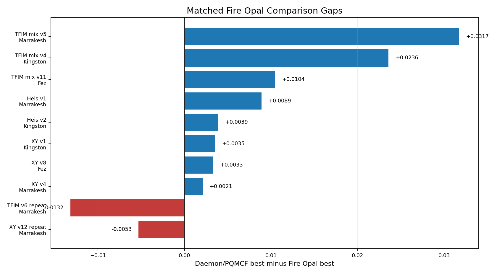
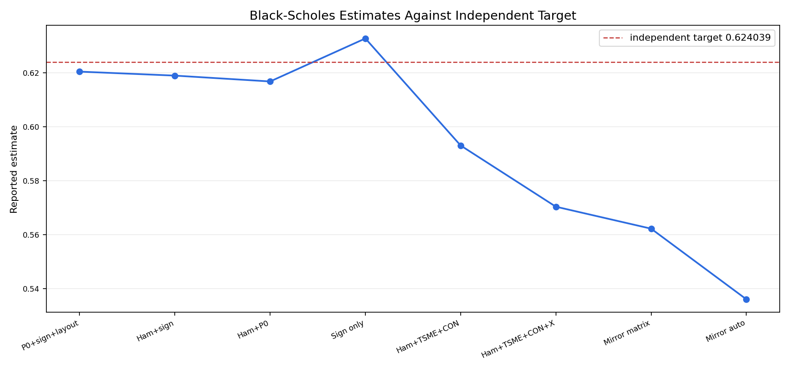
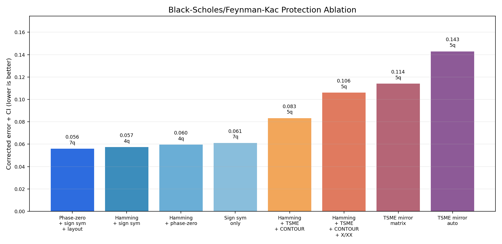

# Daemon Evidence Summary

Updated 2026-05-29.

This note summarizes the public Daemon result artifacts. It uses the benchmark tables and graph files in this repo; compiler internals, route scoring weights, calibration policy, and unpublished derivations are not included.

## 1. Repository Scope

The public evidence has three main lanes:

| Lane | Evidence |
| --- | --- |
| CONTOUR deep-time protection | Live hardware results where CONTOUR preserves signal in deeper drift-sensitive windows. |
| Fire Opal comparisons | Matched benchmark packets where Daemon/PQMCF beats Fire Opal on several IBM workloads, with repeatability caveats shown explicitly. |
| Black-Scholes/Feynman-Kac scalar route | A PDE-derived scalar route that runs on IBM hardware and reports job IDs, QPU time, estimate, independent target, and protection ablation. |

The results are branch-specific. Some protection branches help this route, and some add too much overhead. The reports keep those outcomes visible instead of reducing the project to a single best-case number.

## 2. Matched Fire Opal Comparisons

The Fire Opal lane compares Daemon/PQMCF branches against Q-CTRL Fire Opal on matched live IBM workloads.



Completed matched wins:

| Workload | Backend | Daemon / PQMCF best | Fire Opal best | Gap |
| --- | --- | ---: | ---: | ---: |
| TFIM mixed n16 v5 | IBM Marrakesh | 0.904184 | 0.872475 | +0.031709 |
| TFIM mixed n16 v4 | IBM Kingston | 0.921005 | 0.897435 | +0.023570 |
| TFIM mixed n16 v11 | IBM Fez | 0.917041 | 0.906602 | +0.010439 |
| Heisenberg mixed n16 v1 | IBM Marrakesh | 0.932244 | 0.923357 | +0.008887 |
| Heisenberg mixed n16 v2 | IBM Kingston | 0.929821 | 0.925930 | +0.003891 |
| XY ring n16 v1 | IBM Kingston | 0.971454 | 0.967945 | +0.003509 |
| XY ring n16 v8 | IBM Fez | 0.979066 | 0.975757 | +0.003309 |
| XY ring n16 v4 | IBM Marrakesh | 0.974682 | 0.972600 | +0.002082 |

Repeatability reruns:

| Workload | Backend | Daemon / PQMCF best | Fire Opal best | Gap |
| --- | --- | ---: | ---: | ---: |
| TFIM mixed n16 v6 repeat | IBM Marrakesh | 0.882243 | 0.895440 | -0.013197 |
| XY ring n16 v12 repeat | IBM Marrakesh | 0.970332 | 0.975651 | -0.005319 |

Interpretation:

| Point | Meaning |
| --- | --- |
| Strongest matched win | +0.031709 on TFIM mixed n16 v5, IBM Marrakesh. |
| Cross-backend coverage | Completed wins include Marrakesh, Kingston, and Fez. |
| Boundary | The result supports benchmark-scoped wins, not a general claim across all workloads or calibration windows. |

Primary artifact:

[fireopal_matched_results.md](fireopal_matched_results.md)

## 3. CONTOUR Deep-Time Hardware Protection

CONTOUR is Daemon's phase/drift protection lane. The existing repo already contains real plots from the hardware/deep-window result set.


Torino aggregate snapshot:

| Metric | Result |
| --- | ---: |
| Slots | 12 |
| Wins vs X | 12/12 |
| Wins vs BB1 | 12/12 |
| Wins vs XY4 | 11/12 |
| Mean dX | +0.1966 |
| Mean dBB1 | +0.0833 |
| Mean dXY4 | +0.0531 |
| Mean CONTOUR fidelity | 0.2669 |
| Mean no-drift ceiling | 0.2829 |
| Mean headroom | +0.0159 |

Deep-only confirmation:

| Comparison | Result |
| --- | --- |
| CONTOUR vs X | 6/6 wins |
| CONTOUR vs BB1 | 6/6 wins |
| CONTOUR vs XY4 | 6/6 wins |
| Mean absolute gain vs XY4 | +0.0423 |

Primary artifacts:

| Artifact | Link |
| --- | --- |
| Main public summary | [results.md](results.md) |
| Deep check today 2 | [deep_check_today2.md](deep_check_today2.md) |
| Deep check today 5 | [deep_check_today5.md](deep_check_today5.md) |
| Marrakesh deep run | [marrakesh_deep_today6.md](marrakesh_deep_today6.md) |

## 4. Black-Scholes / Feynman-Kac Scalar Route

The Black-Scholes lane is the application-linked result. The target is a scalar value derived from a high-dimensional Black-Scholes basket PDE through a Feynman-Kac expectation route.

Public route:

```text
high-dimensional Black-Scholes basket PDE
-> Feynman-Kac scalar expectation
-> phase-estimator quantum route
-> protected IBM execution
-> independent target check
```

Best corrected live branch in the current report:

| Field | Value |
| --- | --- |
| Backend | IBM Marrakesh |
| Job | `d8c98ij8ch0s738ugrug` |
| QPU time | `3.000s` |
| Estimate | `0.6205121893` |
| Independent target | `0.6240388897` |
| Corrected error+CI | `0.055871195` |
| Projected high-dimensional MC comparison | `250.902x` |



Readout:

| Item | Interpretation |
| --- | --- |
| PDE route | The run starts from a Black-Scholes/Feynman-Kac scalar target. |
| Hardware execution | The report includes IBM backend, job ID, QPU time, estimate, and target comparison. |
| Boundary | This is a scalar route benchmark, not a full PDE-surface solve. |

Primary artifact:

[../reports/licensing_evidence/daemon_black_scholes_corrected_protection_ablation_current_20260528.md](../reports/licensing_evidence/daemon_black_scholes_corrected_protection_ablation_current_20260528.md)

## 5. Black-Scholes Protection Ablation

The protection ablation shows how the deployed route changes as each protection family is added.



Ablation table:

| Rank | Method family | Corrected error+CI | QPU s | Qubits |
| ---: | --- | ---: | ---: | ---: |
| 1 | Phase-zero + sign symmetry + protected layout | 0.055871195 | 3.000 | 7 |
| 2 | Hamming phase compression + sign symmetry | 0.057348679 | 3.000 | 4 |
| 3 | Hamming + phase-zero | 0.059517201 | 3.000 | 4 |
| 4 | Sign symmetry only | 0.061124328 | 3.000 | 7 |
| 5 | Hamming + TSME shelter + CONTOUR ordering | 0.083265351 | 3.000 | 5 |
| 6 | Hamming + TSME shelter + CONTOUR echo + X/XX echo | 0.105975490 | 3.000 | 5 |
| 7 | TSME terminal mirror + matrix decoder | 0.114125250 | 3.000 | 5 |
| 8 | TSME terminal mirror + auto decoder | 0.142901850 | 3.000 | 5 |

Observed role in this run:

| Component | Observed role |
| --- | --- |
| Phase-zero calibration | Best branch included it; it stabilizes the shallow phase estimator. |
| Sign symmetry | Present in the best branches and retained the strongest Black-Scholes route. |
| Protected layout selection | Present in the best branch and keeps physical routing part of the runtime decision. |
| Hamming phase compression | Reduced qubits from 7 to 4 while staying close to the best error+CI branch. |
| TSME shelter + CONTOUR ordering | Implemented and live-tested, but not yet the best branch on this shallow route. |
| CONTOUR echo + X/XX echo | Available but too expensive for this shallow Black-Scholes branch in the current report. |
| TSME terminal mirror | Physically implemented, but selector-gated because forced deployment worsened this route. |

The current Black-Scholes result favors low-tax protection. Heavier TSME/CONTOUR/X-XX branches are implemented and measured, but they are not automatically better on shallow circuits.

## 6. TSME / CONTOUR / X-XX Hardening

The latest Black-Scholes hardening pass added:

| Hardening item | Purpose |
| --- | --- |
| TSME terminal mirror decode | Mirror the terminal phase bit onto a shelter wire and decode through agreement. |
| TSME mirror matrix decoder | Use a calibrated two-bit readout matrix over `00`, `01`, `10`, and `11`. |
| TSME auto decoder | Select matrix decoding only when support behavior justifies it. |
| Mirror agreement gating | Reject mirror packets when shelter/ancilla agreement is poor. |
| Effective-shot CI correction | Widen confidence intervals when filtering reduces logical shots. |
| No-harm protection selector | Disable optional physical protection when routed tax exceeds the predicted benefit. |
| Counts persistence | Retain raw counts for later target-blind decoder reanalysis. |

Primary artifact:

[../reports/licensing_evidence/daemon_black_scholes_protection_hardening_update_20260528.md](../reports/licensing_evidence/daemon_black_scholes_protection_hardening_update_20260528.md)

## 7. Combined Readout

| Evidence lane | Strongest public signal | Current boundary |
| --- | --- | --- |
| Fire Opal comparisons | Multiple completed matched wins, strongest observed gap +0.031709. | Repeatability and broader workload coverage remain validation targets. |
| CONTOUR deep-time | 12/12 vs X, 12/12 vs BB1, 11/12 vs XY4 in the Torino aggregate. | Hardware protection evidence, not an application result by itself. |
| Black-Scholes scalar route | IBM Marrakesh scalar PDE route with job ID, target check, and protection ablation. | Scalar route benchmark, not full PDE surface. |
| TSME/CONTOUR/X-XX hardening | Physical branches exist and are measured; no-harm selection prevents overprotection. | Best Black-Scholes branch is currently low-tax protection. |

## 8. Discussion and Limits

Supported by this public repo:

- Daemon has live IBM evidence for a Black-Scholes/Feynman-Kac scalar route.
- Daemon has public CONTOUR deep-window protection evidence.
- Daemon has benchmark-scoped matched Fire Opal wins.
- Daemon has protection ablations showing which branches helped this route.

Not claimed here:

- Daemon universally beats Fire Opal.
- Daemon solves arbitrary PDEs.
- Daemon has proven full Black-Scholes application advantage.
- Daemon has solved an entire PDE surface on a quantum computer.

